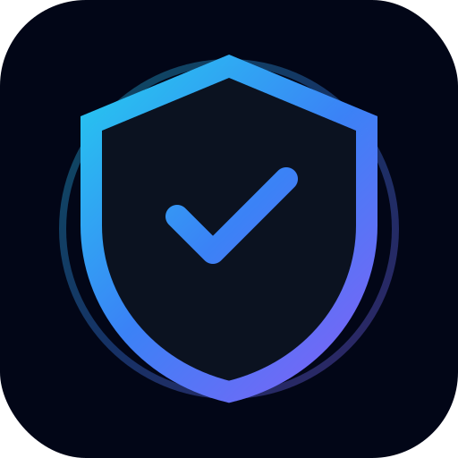
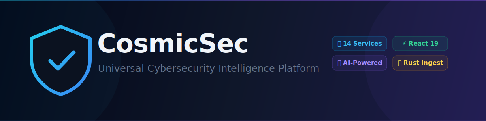

<div align="center">



# CosmicSec

### Universal Cybersecurity Intelligence Platform

AI-native hybrid cybersecurity platform unifying recon, scanning, AI analysis, reporting, collaboration, and local-agent execution across STATIC, DYNAMIC, and LOCAL operation modes.



<br/>

[](LICENSE)
[](https://python.org)
[](https://fastapi.tiangolo.com)
[](https://react.dev)
[](https://typescriptlang.org)
[](https://rust-lang.org)
[](https://github.com/astral-sh/ruff)
[](https://github.com/mufthakherul/CosmicSec/security/code-scanning)
[](docker-compose.yml)

</div>

> **⚠️ Authorized & Ethical Use Only.** CosmicSec is designed exclusively for ethical cybersecurity research, authorized penetration testing, and blue-team training. See [LICENSE](LICENSE) for full terms.

---

## What is CosmicSec?

CosmicSec is a **hybrid, AI-powered cybersecurity intelligence platform** that unifies vulnerability scanning, recon, threat analysis, reporting, and team collaboration into a single, modern platform built on microservices.

It serves multiple user modes via a single intelligent gateway — see the full **[Access-Mode Capability Matrix](docs/ROADMAP_UNIFIED.md#2-access-mode-capability-matrix)** for the complete picture:

| Mode | User | Runs On | Access |
|------|------|---------|--------|
| `STATIC` | Public / Unregistered | Server (pre-rendered) | Landing, feature demo, guest sandbox |
| `DYNAMIC` | Registered Dashboard User | Cloud / self-hosted | Full dashboard, real-time scans, AI, reports |
| `LOCAL` | CLI / Local-Agent User | User's own machine | Terminal agent, local tool orchestration, optional cloud sync |
| `LOCAL_WEB` | Isolated browser user | Local server | Full web UI with zero cloud egress |
| + more | Mobile, Desktop, SDK, ChatOps | Various | See roadmap for planned modes |

---

## ✨ Key Features

| Category | Capabilities |
|----------|-------------|
| 🛡️ **Hybrid Architecture** | HybridRouter: STATIC / DYNAMIC / LOCAL / DEMO / EMERGENCY modes via one gateway |
| 🤖 **AI-Powered Analysis** | LangChain + LangGraph workflows, MITRE ATT&CK mapping, zero-day prediction, RAG knowledge base |
| 🔍 **Recon Engine** | DNS enum, Shodan, VirusTotal, crt.sh, RDAP, passive OSINT |
| 📡 **Distributed Scanning** | Multi-engine scanner (nmap, nikto, nuclei), Celery tasks, smart orchestration, continuous monitoring |
| 📊 **Rich Reporting** | PDF, DOCX, JSON, CSV, HTML; SOC 2, PCI-DSS, HIPAA templates; topology/heatmap/attack-path viz |
| 👥 **Team Collaboration** | Real-time WebSocket rooms, presence, @mentions, threaded edits |
| 🔌 **Plugin Ecosystem** | Plugin SDK + official plugins (nmap, metasploit, Jira, Slack, report exporters) |
| 🔐 **Enterprise Auth** | JWT, OAuth2, TOTP/2FA, Casbin RBAC, per-user rate limiting, WAF middleware |
| 💻 **CLI Local Agent** | Discovers & orchestrates local tools (nmap, nikto, sqlmap, metasploit), streams to cloud |
| 📦 **Multi-language SDKs** | Python, TypeScript (`@cosmicsec/sdk`), Go — 13–14 methods, JWT + API-key auth |
| 📈 **Observability** | Prometheus, Grafana, Loki, Jaeger, OpenTelemetry, Sentry integration |
| 🏗️ **IaC** | Terraform (AWS RDS/ElastiCache/EKS), Helm chart, ArgoCD GitOps, Traefik v3 TLS |

---

## 🏗️ Architecture Overview

```
┌──────────────────────────────────────────────────────────────────────────┐
│                             USER LAYER                                   │
│  [Public Browser]         [Auth'd Browser]         [CLI Terminal / IDE]  │
│   STATIC mode              DYNAMIC mode               LOCAL mode         │
└────────┬──────────────────────┬──────────────────────────┬───────────────┘
         │                      │                          │
         ▼                      ▼                          │
┌──────────────────────────────────────────────┐           │
│          Traefik v3 (Edge Gateway)           │           │
│    TLS · Rate Limit · WAF · Load Balance     │           │
└──────────────────────┬───────────────────────┘           │
                       │                                   ▼
┌──────────────────────────────────────────────────────────────────────────┐
│              CosmicSec API Gateway  (:8000)                              │
│   HybridRouter · RBAC · WebSocket hub · Per-user rate limit              │
│   Structured logging · OpenTelemetry · GraphQL runtime · WAF             │
└───────────────────────────────┬──────────────────────────────────────────┘
                                │
         ┌──────────────────────┼────────────────────────────────────────┐
         ▼                      ▼                                        ▼
┌─────────────────┐  ┌───────────────────────────────────┐  ┌─────────────────────┐
│  Static Profiles│  │      Backend Microservices         │  │  CLI Local Agent    │
│  (instant mock  │  │  Auth · Scan · AI · Recon          │  │  (Python + Rust)    │
│   responses)    │  │  Report · Collab · Plugins         │  │  nmap/nikto/sqlmap  │
└─────────────────┘  │  Integration · BugBounty · Phase5  │  │  streams JSON →     │
                     │  Notification · AdminService        │  │  WebSocket / REST   │
                     └────────────────┬──────────────────┘  └─────────────────────┘
                                      │
         ┌────────────────────────────┼───────────────────────────────────┐
         ▼                            ▼                                   ▼
   PostgreSQL                  MongoDB + Redis                     Elasticsearch
   (core data)                 (OSINT / cache)                     (logs / search)
```

### Microservices

| Service | Port | Description |
|---------|------|-------------|
| API Gateway | 8000 | HybridRouter, RBAC, WebSocket, rate limiting, Prometheus, GraphQL |
| Auth Service | 8001 | JWT, OAuth2, TOTP/2FA, Casbin RBAC, session management |
| Scan Service | 8002 | Distributed scanner, smart orchestration, continuous monitoring, Celery |
| AI Service | 8003 | LangChain + LangGraph, ChromaDB, MITRE ATT&CK, anomaly detection, Ollama |
| Recon Service | 8004 | DNS, Shodan, VirusTotal, crt.sh, RDAP passive recon |
| Report Service | 8005 | Multi-format reports, compliance templates, attack-path visualization |
| Collab Service | 8006 | WebSocket rooms, presence tracking, team chat, @mentions |
| Plugin Registry | 8007 | Plugin SDK, official plugins (nmap, metasploit, Jira, Slack) |
| Integration Svc | 8008 | SIEM (Splunk/Elastic), third-party integrations hub |
| Bug Bounty Svc | 8009 | HackerOne / Bugcrowd / Intigriti, submission workflow |
| Phase 5 / SOC | 8010 | SOC ops, incident response, SAST, DevSecOps CI gates |
| Agent Relay | 8011 | CLI agent WebSocket hub, task dispatch |
| Notification Svc | 8012 | Email, Slack, webhook notifications |

---

## 🚀 Quick Start

### Prerequisites

- Python 3.11+
- Docker & Docker Compose v2
- Node.js 22+ (for frontend development)

### Clone & Setup

```bash
git clone https://github.com/mufthakherul/CosmicSec.git
cd CosmicSec

# Copy environment template
cp .env.example .env
# Edit .env with your configuration

# Install Python dependencies
pip install -r requirements.txt
```

### Run with Docker (Recommended)

```bash
docker-compose up --build
```

| Service | URL |
|---------|-----|
| **API Gateway** | http://localhost:8000 |
| **Frontend (dev)** | http://localhost:3000 |
| **Grafana** | http://localhost:3001 |
| **Prometheus** | http://localhost:9090 |
| **Traefik dashboard** | http://localhost:8080 |

### Run Frontend

```bash
cd frontend
npm install
npm run dev
# Optional: generate bundle report at frontend/dist/stats.html
npm run analyze

# Component library (Storybook)
npm run storybook
# Static Storybook build
npm run build-storybook
```

When GitHub Pages is enabled for this repository, Storybook deploys from CI at:

`https://mufthakherul.github.io/CosmicSec/`

and can be mounted under a `/storybook/` path depending on Pages configuration.

### Run CLI Agent (Local Mode)

```bash
cd cli/agent
pip install -e .
cosmicsec --help
```

### Run Individual Backend Services

```bash
# API Gateway
uvicorn services.api_gateway.main:app --port 8000 --reload

# Auth Service
uvicorn services.auth_service.main:app --port 8001 --reload
```

### Tests

```bash
# Python backend tests
pytest tests/ -v --cov=services --cov-report=term-missing

# Frontend unit tests
cd frontend && npm run test

# Frontend E2E tests
cd frontend && npm run test:e2e
```

### Linting & Formatting

```bash
# Python
ruff check .
ruff format .

# Frontend
cd frontend && npx tsc --noEmit
```

---

## 📦 SDKs

CosmicSec provides official SDKs for three languages:

| SDK | Package | Methods |
|-----|---------|---------|
| **TypeScript** | `sdk/typescript/` (`@cosmicsec/sdk`) | 14 typed methods + `AgentWebSocketClient` |
| **Python** | `sdk/python/` | httpx sync client, runtime envelope parser |
| **Go** | `sdk/go/` | 13 methods, JWT + API-key auth, envelope unwrapping |

---

## 🔌 Plugin Development

CosmicSec supports community plugins via the Plugin SDK. See [`sdk/`](sdk/) and [`plugins/`](plugins/) for examples.

```python
from plugins.sdk import PluginBase

class MyPlugin(PluginBase):
    name = "my-plugin"
    version = "1.0.0"

    async def run(self, context):
        # Your plugin logic here
        ...
```

---

## 📁 Project Structure

See the full maintained structure map: **[`docs/DIRECTORY_STRUCTURE.md`](docs/DIRECTORY_STRUCTURE.md)**

```
CosmicSec/
├── services/           # 13 FastAPI microservices + shared common modules
├── cosmicsec_platform/ # Shared middleware: HybridRouter, static profiles, policies
├── frontend/           # React 19 + TypeScript + Vite + TailwindCSS v4
├── cli/                # Local agent package (Python) + CLI assets
├── ingest/             # Rust high-speed ingest pipeline
├── sdk/                # Python / TypeScript / Go SDKs
├── plugins/            # Plugin SDK + official plugins
├── infrastructure/     # Terraform, Traefik, ArgoCD
├── helm/               # Kubernetes Helm chart
├── alembic/            # Database migrations
├── tests/              # Unit, integration, e2e tests (1260+ lines)
└── docs/               # Architecture docs, guides, visual assets
```

---

## 🏛️ Compliance & Standards

| Standard | Status |
|----------|--------|
| OWASP Top 10 | Addressed in scan templates |
| NIST CSF | Report templates available |
| SOC 2 | Compliance readiness dashboard |
| PCI-DSS | Compliance readiness dashboard |
| HIPAA | Compliance readiness dashboard |
| ISO 27001 | Report templates available |
| MITRE ATT&CK | AI analysis fully mapped |

---

## 🤝 Contributing

We welcome contributions from the security community! Please read [CONTRIBUTING.md](CONTRIBUTING.md) before submitting pull requests.

See the **[Unified Roadmap](docs/ROADMAP_UNIFIED.md)** for a breakdown of planned work waves (Wave 1–4) and contribution opportunities.

---

## 🔒 Security

Found a vulnerability? Please follow our [responsible disclosure policy](SECURITY.md) — **do not open a public GitHub issue for security vulnerabilities**.

Security scanning is automated via GitHub CodeQL (Python + TypeScript) on every push and weekly schedule.

---

## 📜 License

Licensed under a **Custom MIT License with Ethical Use & AI Restriction Clauses**. See [LICENSE](LICENSE).

**TL;DR**: Free for ethical cybersecurity research, education, and authorized engagements. Commercial use and offensive/unethical use require explicit written permission.

---

## 👤 Author

**Mufthakherul Islam Miraz**
- Website: [mufthakherul.github.io](https://mufthakherul.github.io)
- Email: mufthakherul_cybersec@s6742.me

---

## 🌟 Acknowledgements

CosmicSec is built on the shoulders of giants in the open-source security community. We gratefully acknowledge FastAPI, LangChain, Celery, MITRE ATT&CK, React, Rust, and all contributors whose work makes this platform possible.

