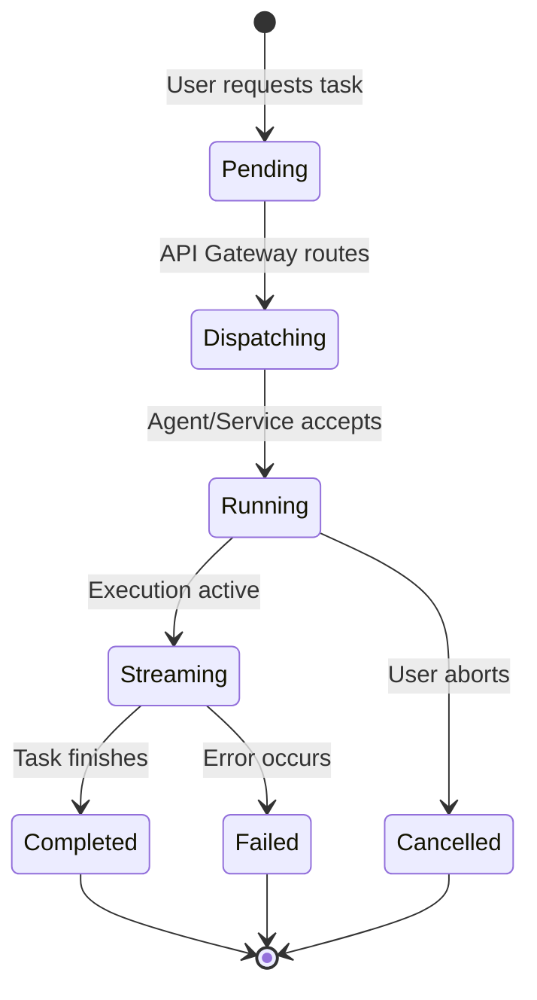

# CosmicSec Flowchart

> Supplemental execution-flow view.
> Canonical implementation status remains in `report.md`, `ROADMAP.md`, and `gap_analysis.md`.

## System Execution Flowchart

```mermaid
flowchart TD
    User([User (CLI/WebApp)]) -->|Natural Language / Command| Gateway[API Gateway :8000]
    
    Gateway -->|Auth Check| Auth[Auth Service :8001]
    Auth -->|Valid Token| Gateway
    
    Gateway -->|Parse Intent| AI[AI Service :8003]
    AI -->|Classify Intent & Plan| Gateway
    
    Gateway -->|Execute Recon| Recon[Recon Service :8004]
    Gateway -->|Execute Scan| Scan[Scan Service :8002]
    Gateway -->|Dispatch to CLI| Relay[Agent Relay :8011]
    
    Relay -.->|WebSocket| LocalAgent[CLI Local Agent]
    LocalAgent -->|Run Local Tool| LocalTool((Nmap/Nikto/etc))
    LocalTool -->|Results| LocalAgent
    LocalAgent -.->|WebSocket Stream| Relay
    Relay -->|Aggregate| Scan
    
    Scan -->|Persist Findings| DB[(PostgreSQL)]
    Recon -->|Persist OSINT| Mongo[(MongoDB)]
    
    Scan -->|Notify| Collab[Collab & UI]
    Recon -->|Notify| Collab
    Collab -->|Update Dashboard| User
```

## Task Lifecycle



---

## Progress Tracking

### ✅ What is Already Done
- Fully implemented API Gateway as the central HybridRouter.
- Connected CLI Agent via WebSocket to Agent Relay.
- Working task dispatch flow (Pending -> Running -> Completed).
- Asynchronous task streaming via NDJSON.
- Integration between Scan Service and local agent results.

### 🚧 What Needs to be Implemented
- **Unified Tool Registry Routing**: Ensure API Gateway can intelligently route tasks to either the WebApp Server or CLI agent depending on tool availability in the shared registry.
- **Deeper WebSocket-Native Progress Indicators**: Expand live percentage and per-tool timing telemetry to match CLI depth.

### 🔄 What Needs to be Updated/Modified
- **AI Service Intent Routing**: Enhance the AI service to trigger all forms of tools directly into the Task Lifecycle, not just basic scans.

### ❌ What Needs to be Removed (Deprecation Phase)
- **Direct Webhooks**: Deprecated in favor of the notification service handling all webhooks internally.
