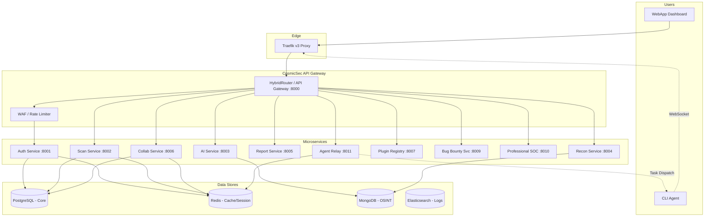

# CosmicSec Project Diagram

> Supplemental component-level visualization.
> Canonical implementation status remains in `report.md`, `ROADMAP.md`, and `gap_analysis.md`.

## Component Diagram

---

## Scope Note

This file is a component visualization aid.
Do not use it as a source of implementation status; use `ROADMAP.md`, `report.md`, and `gap_analysis.md`.
